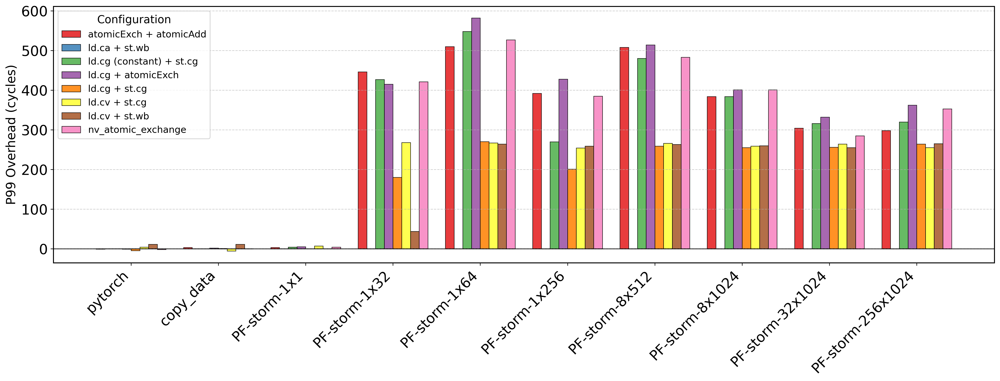
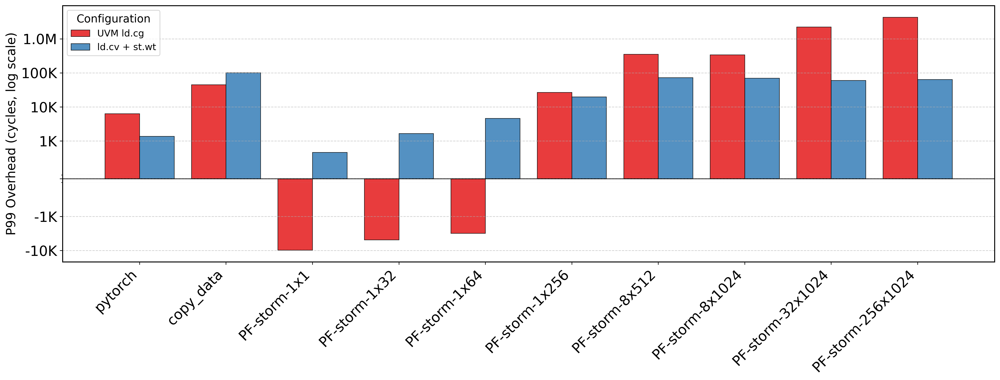
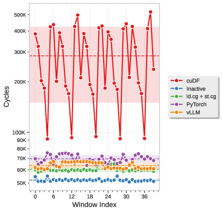

# NVIDIA MIG Page Fault Side Channel

## Introduction

[NVIDIA MIG](https://www.nvidia.com/en-us/technologies/multi-instance-gpu/) is
a technology to partition a GPU into multiple GPU Instances (GIs). Each GI
has a slice of available computational (GPCs - SMs) and memory (VRAM/L2) resources.
MIG can be deployed on containers or virtual machine (through vGPU).
However, previous work has shown that the L3-TLB and PCIe bus are shared component
between GIs, enabling side channel to fingerprint workloads running on a co-located GI.
In this work we show that also the UVM (Unified Virtual Memory) page fault latency
can be used to fingerprint workloads running on co-located GIs.
We identified three main sources of contention that contribute to the page fault latency
variation:

1. PCIe bus usage.
2. Memory access operations on L2/Constant Cache/VRAM.
3. Shared kernel-level driver code and queue (fault buffer) - Only applicable to
concurrent UVM workloads in containerized environments.

Full paper at: https://openreview.net/forum?id=RffwXvNEMJ

## Tests

### Requirements and Setup

Tested on Ubuntu 24

```
./setup.sh
```

### Cross-GI Interference

We test whether a page fault storm running on GPU Instance 0 influence the
latency of simple GPU kernels that access memory through different cache hints
operator on GPU Instance 1.
First, we collect the latencies when GPU Instance 0 is not running a page fault storm (idle baseline) for different GPU kernels, then we collect the latencies when GPU Instance 0 executes a page fault storm or other types of workload (PCIe usage - copy_data, PyTorch).

```
./run_docker_cross_gi.sh
python3 plotter_cache.py -s p99 -o figs/ --log_scale on
```

GPU device memory accesses (L1/L2/Constant Cache/VRAM) latency overhead plot:


GPU host memory accesses (PCIe/UVM-based memory) latency overhead plot:


### Side Channel

We collect page fault latencies on GPU Instance 0, while GPU Instance 1 executes
different types of workload.

#### Simple Case Plot

```
./run_docker_simple.sh
python3 plotter_simple.py --logs_dir ./logs_simple --plot_type tail_avg --window_size
 3000 --fig_output ./figs/pf_latency_simple.pdf --show_uncertainty --log_scale on
```



#### vLLM Model Fingerprint

```
./run_docker_vllm.sh
python3 classifier_llm.py --logs_dir ./logs_llm/ --window_size 30000 --step 3000
```

## Disclosure

We reported to NVIDIA that side channel can fingerprint ML workloads across GPU Instances in march 2025, and they acknowledged the risk.
